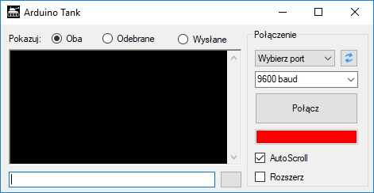
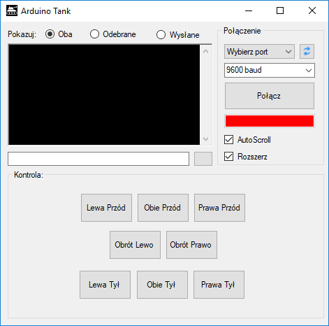

# Arduino Tank Controller App

## Overview

<!-- TOC -->

- [Overview](#overview)
- [Download](#download)
- [Screenshots](#screenshots)

<!-- /TOC -->

Icon | Description
:---: | ---
 | Serial client app I created to use it with Arduino Leonardo board to control my bigger project - Arduino Tank. App contains console with ability to read and write with specified connection speed (in bauds). The additional feature aside of standard serial console is predefined buttons grid which sends signals (text) to console and finally to Arduino. The purpose of that buttons is to control functions of Arduino Tank easier.

## Download

Binary download for Windows, require .NET Framework 4.5 installed to run.

- [Initial version](bin/ArduinoTank.exe)

## Screenshots

> TODO: Add screenshots of the app with connected Arduino board.

Compact | Expanded
:---: | :---:
 | 
